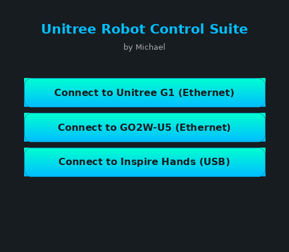

# Unitree Robot Control Suite

GTK3 control UI for **Unitree G1** and **GO2W** robots — camera streaming, Inspire Hand serial control, SLAM/navigation (Hesai XT16), and Unitree SDK2 integration.

**Status:** stable · **Project age:** started 2025-10-24 (~10 months) · **Requires:** Ubuntu 20.04/22.04, physical G1 or GO2W, SDK paths below · [MIT](LICENSE)

> **Origin:** Built when the G1 was new — among the first units in Belgium, before community docs or vendor support existed. One desktop app to wire SDK2, ROS2, SLAM, sim, and peripherals together.

[](https://github.com/Airuxn/unitree-robot-control-suite/actions/workflows/ci.yml)
[](https://codecov.io/gh/Airuxn/unitree-robot-control-suite)
[](LICENSE)

**Quality:** CI (compile, ShellCheck, submodules) · CodeQL · Dependabot · Vercel `ignoreCommand` waits for CI + CodeQL if hosted on Vercel

**Deep dive:** [Building a control suite when nothing existed yet](docs/BUILDING_WITHOUT_A_COMMUNITY.md) — early G1 context, network layer, G1 vs GO2W architecture, SLAM workflows.



---

## Quick start

```bash
git clone https://github.com/Airuxn/unitree-robot-control-suite.git
cd unitree-robot-control-suite
chmod +x install.sh
./install.sh
python3 unitree_robot_control_suite.py
```

Verify paths after install: `./scripts/verify_installation.sh`

Full manual install (ROS2, SDK2, MuJoCo, CycloneDDS): [docs/INSTALL.md](docs/INSTALL.md)

---

## Features

- G1 and GO2W robot control from a single GTK3 GUI
- Real-time camera streaming (`go2w_camera_viewer.py`)
- Inspire Hand control via CH340 serial (`inspire_hand/`, based on [Sentdex/inspire_hands](https://github.com/Sentdex/inspire_hands))
- SLAM mapping and relocation with Hesai XT16 lidar (RViz configs included)
- PCD map listing and visualization
- MuJoCo simulation hooks
- WiFi / Ethernet network management for robot link

---

## Required SDK paths

The application expects **fixed install locations**. `install.sh` targets these paths — do not relocate without updating the app.

| Component | Path |
|-----------|------|
| Unitree SDK2 (C++) | `~/unitree_sdk2/` |
| Unitree SDK2 Python | `~/unitree_sdk2_python/` |
| Unitree ROS2 | `~/unitree_ros2/` |
| Unitree MuJoCo | `~/unitree_mujoco/` |
| CycloneDDS workspace | `~/unitree_ros2/cyclonedds_ws/` |
| Unitree G1 Autonomous | `~/unitree-g1-autonomous/` |
| ROS2 Humble | `/opt/ros/humble/setup.bash` |
| Inspire Hand module | `./inspire_hand/` (in repo) |

Official SDKs: [unitree_sdk2](https://github.com/unitreerobotics/unitree_sdk2) · [unitree_sdk2_python](https://github.com/unitreerobotics/unitree_sdk2_python) · [unitree_ros2](https://github.com/unitreerobotics/unitree_ros2) · [unitree_mujoco](https://github.com/unitreerobotics/unitree_mujoco)

---

## System requirements

| | |
|--|--|
| **Hardware** | Unitree G1 or GO2W; Ubuntu PC; Ethernet or WiFi to robot; USB for Inspire Hand (CH340) |
| **Software** | Python 3.10+, ROS2 Humble, GTK3, OpenCV, pcl-tools, full Unitree SDK2 stack |

Default robot IP: `192.168.123.164` (user `unitree`). Default Ethernet interface: `enp3s0`.

---

## Repository layout

| Path | Description |
|------|-------------|
| `unitree_robot_control_suite.py` | Main GTK3 application |
| `go2w_camera_viewer.py` | Standalone camera viewer |
| `connect_inspire_hand.sh` | Inspire Hand connection helper |
| `install.sh` | Automated SDK + dependency installer |
| `scripts/verify_installation.sh` | Post-install path checks |
| `inspire_hand/` | Inspire Hand Python module |
| `docs/INSTALL.md` | Step-by-step manual installation |

---

## Testing strategy

Coverage is scoped to the pure helpers that can run in CI without GTK3, ROS2, or a physical robot. The GUI/ROS/hardware classes in `unitree_robot_control_suite.py` are marked with `# pragma: no cover`, and `codecov.yml` lists the fully untestable files (camera viewer, shell scripts, submodule code, configs, docs).

The three test layers are:

1. **Unit tests** (`tests/`): config load/save, robot IP selection, and network interface selection, with GTK/ROS/netifaces mocked so they run headless in CI.
2. **Static checks** (CI): Python `py_compile` for all `.py` files, ShellCheck for shell scripts, submodule verification, and Dependabot for dependency updates.
3. **Integration / hardware-in-the-loop / manual**: ROS2 nodes, SDK2 examples, and the GTK3 UI are exercised on the lab robot; UI screenshots are captured with `scripts/capture_screenshots.py` and `scripts/generate_doc_screenshots.py` for regression documentation.

The Codecov badge reflects the first layer — the testable core helpers. The larger GUI/ROS/hardware layers are validated by the second and third layers, not by the coverage metric.

---

## Usage

```bash
# Main GUI
python3 unitree_robot_control_suite.py

# Camera only
python3 go2w_camera_viewer.py enp3s0

# Inspire Hand CLI
python3 -m inspire_hand.cli interactive
```

SLAM maps save to `/home/unitree/` on the robot as `.pcd` files. See [docs/INSTALL.md](docs/INSTALL.md) for SLAM workflow and troubleshooting.

---

## Security

Local desktop control for robots on your LAN. Default robot SSH credentials are for lab use — change them on production deployments. Never commit API keys or custom network configs.

See [SECURITY.md](SECURITY.md) for data handling and reporting.

---

## What makes this different

This suite was built when the Unitree G1 was new and community documentation was scarce. The goal was a single desktop UI that wires together SDK2, ROS2, SLAM, MuJoCo simulation, and the Inspire Hand — without waiting for upstream examples to exist.

Lessons learned along the way:

- **Robot control UIs are mostly glue.** The value is in reliable command builders, path assumptions, and network fallback logic — not in novel algorithms.
- **Hardware projects need layered testing.** Pure helpers get unit tests, shell and Python syntax get static checks, and anything that touches motion or video gets manual on-robot validation.
- **Fixed install paths are a feature.** Locking SDK locations (`~/unitree_sdk2/`, `~/unitree_ros2/`, etc.) makes the app reproducible across lab machines and reduces "works on my laptop" surprises.

---

## 🤝 Contributing

1. Fork the repository
2. Create a feature branch: `git checkout -b feature-name`
3. Commit changes: `git commit -am 'Add feature'`
4. Push to branch: `git push origin feature-name`
5. Submit a Pull Request

---

## 📄 License

This project is licensed under the MIT License — see the [LICENSE](LICENSE) file for details.

---

## 🙏 Acknowledgments

- [Sentdex/inspire_hands](https://github.com/Sentdex/inspire_hands) — Inspire Hand Python library
- [Unitree Robotics](https://www.unitree.com/) — SDK and robot platforms
- [ROS 2](https://www.ros.org/) — robotics middleware

---

## 📞 Support

For support and questions:

- Create an issue on [GitHub](https://github.com/Airuxn/unitree-robot-control-suite/issues)
- Install & troubleshooting: [docs/INSTALL.md](docs/INSTALL.md)
- Security: see [SECURITY.md](SECURITY.md)

---

**⭐ If this project helped you, please give it a star!**
